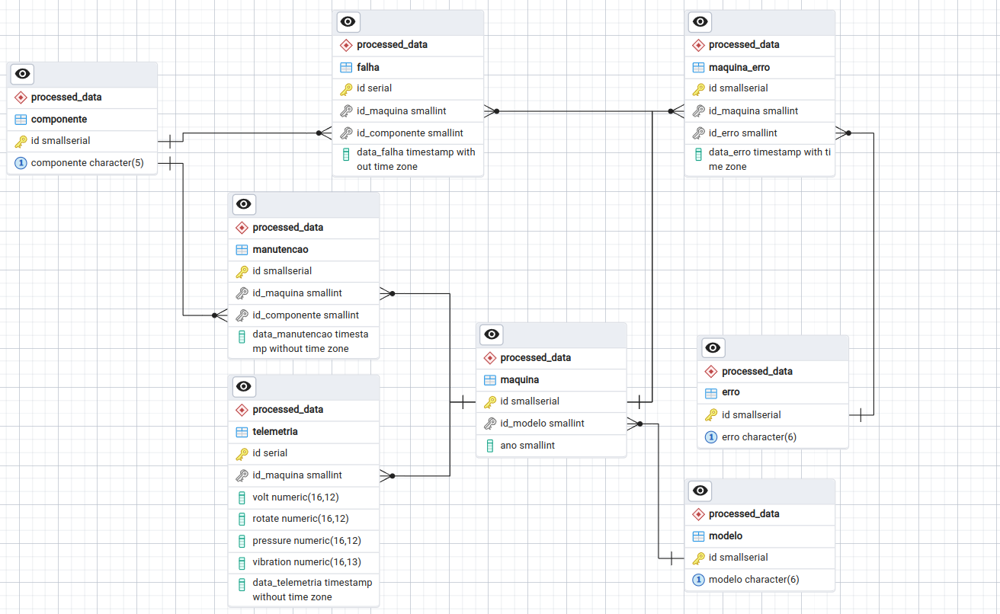

# Apresentação do projeto

Projeto Final para a matéria de Banco de Dados do curso ADA Santander Coders. 

O projeto é apresentado no arquivo Banco de Dados - Projeto Final.pdf. Como solução foi idealizado a carga dos 5 arquivos csv apresentados abaixo em um schema para armanezar os dados brutos. Os arquivos sao:

- PdM_telemetry.csv: Consiste na média horária de tensão, rotação, pressão e vibração coletada de 100 máquinas para o ano de 2015.
- PdM_errors.csv: São os erros encontrados pelas máquinas durante o funcionamento.
- PdM_maint.csv: Registra as manutenções realizadas nas máquinas.
- PdM_failures.csv: Registra as falhas nas máquinas.
- PdM_Machines.csv: Metadados das máquinas, como tipo de modelo e idade.

A partir da modelagem realizada, foi construido um segundo schema para armanezar os dados provenientes do primeiro schema. Além disso, o banco de dados postgres e o pgadmin foram configurados em um ambiente docker.

## Carga dos arquivos csv e Modelagem do Banco de Dados

Para a carga dos arquivos .csv no primeiro schema, é utilizada o o script cargas.sql. Para o segundo schema, é utilizado o script transform_data.sql, adotando a 3º forma normal, a modelagem deste segundo schema pode ser vista no modelo físico do Bancos de Dados, apresentado abaixo:

.

## Queries sobre problemas propostos

Seguindo as perguntas realizadas sobre os dados presentes nos arquivos csv e agora modelados em um Banco de Dados, foi implementado o script perguntas.sql que 
realiza queries correspondentes as perguntas:
- Qual modelo de máquina apresenta mais falhas.
- Qual a quantidade de falhas por idade da máquina.
- Qual componente apresenta maior quantidade de falhas por máquina.
- A média da idade das máquinas por modelo.
- Quantidade de erro por tipo de erro e modelo da máquina.

## Estrutura do projeto

O projeto é composto pelos scripts carga.sql, perguntas.sql, transform_data.sql e o Modelo Físico diagrama-fisico.pgerd, que estão localizadas na pasta que é utilizada como volume do container do pgadmin. Em pgdata é configurado o volume relacionado ao container do banco de dados postgres. Na pasta files há os arquivos csv usados para dar carga no primeiro schema.
```
.
├── Banco de Dados - Projeto Final.pdf
├── data
│   ├── pgadmin
|   |   └──storage
│   │       └── user-name_domain-name.com
│   │           ├── carga.sql
│   │           ├── diagrama-fisico.pgerd
│   │           ├── perguntas.sql
│   │           └── transform_data.sql
│   └── pgdata
├── docker
│   └── docker-compose.yml
├── files
│   ├── PdM_errors.csv
│   ├── PdM_failures.csv
│   ├── PdM_machines.csv
│   ├── PdM_maint.csv
│   └── PdM_telemetry.csv
├── Modelo-Fisico.png
└── README.md
```


